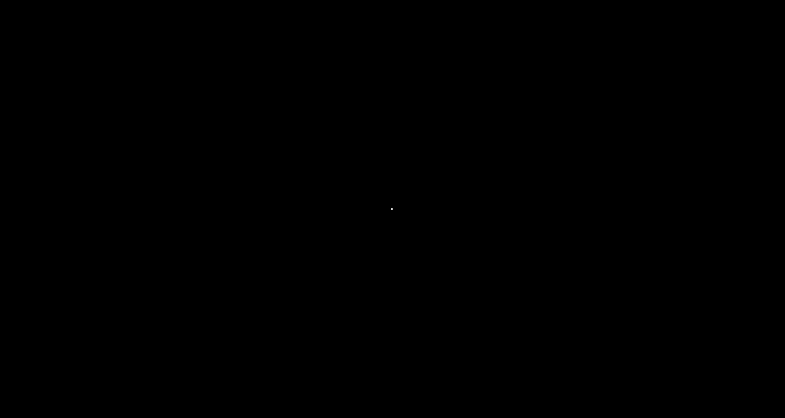
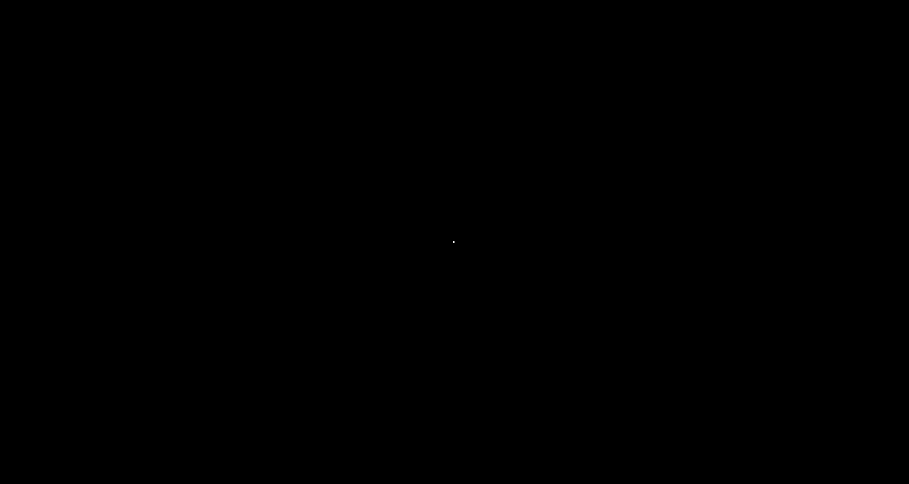

# [Back To Categories](https://github.com/qzpimae/Animations/tree/main#readme)
## [Back To Sacred Geometry Animations](https://github.com/qzpimae/Animations/tree/main/_downloadable_media/GIFs/Sacred-Geometry#readme)

&nbsp

These shapes arise when points are distributed evenly on a sphere and contour lines are drawn when sphere is rotated about the x/y axis

[source](https://github.com/qzpimae/Animations/tree/main/Apr2020/globe/line-art01.js)

&nbsp

&nbsp

These shapes arise when points are distributed oddly on a sphere and contour lines are drawn when sphere is rotated about the x/y axis

[source](https://github.com/qzpimae/Animations/tree/main/Apr2020/globe/line-art02.js)

&nbsp
